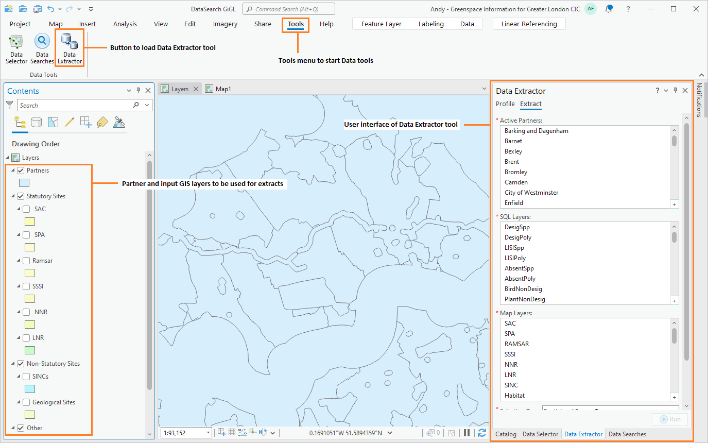
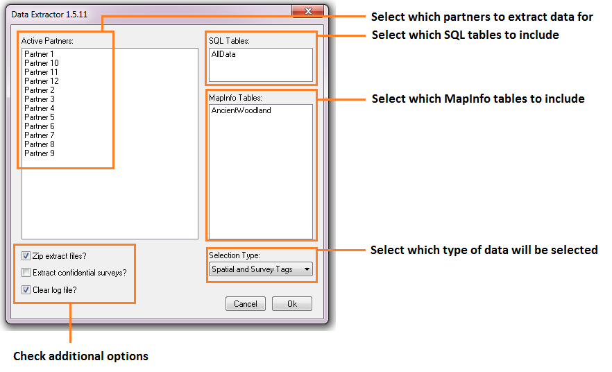
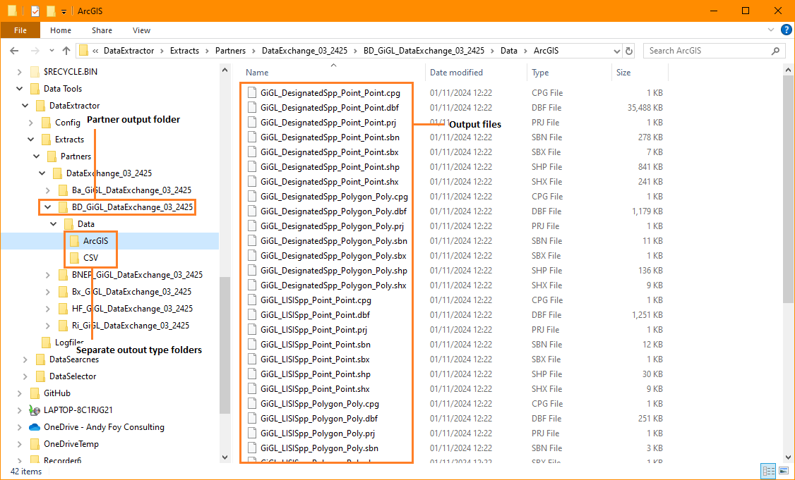
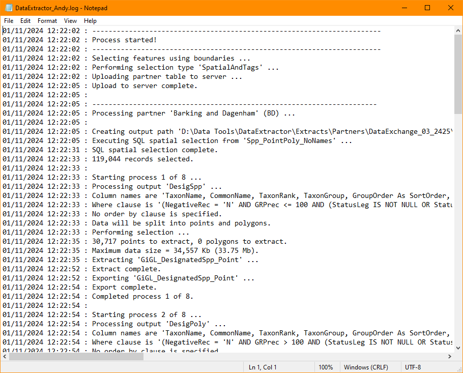

***********************
Anatomy of data extract
***********************

.. index::
	single: Data extract process

This section describes how a typical data extract might be carried out manually, and how the Data Extractor Tool automates this process. Please note that the examples used in this illustration are purely fictional and do not represent a real-world scenario.

Data extract process
====================

The process of a typical data extract can be broken down into a number of distinct steps that are described here. In the next section the way that the Data Extractor Tool carries out these steps is explained.

Defining a partner boundary
	Before any extract can be carried out, a polygon area for which data will be extracted for a partner has to be defined. This may be held in a single GIS layer together with some associated attributes such as the name of the organisation represented by the boundary. Once this area has been entered into the GIS layer it can be used time and again.

Selecting the relevant data layers
	Using the boundary defined in the previous step, each of the data layers relating to the presence of protected sites, habitats, species, etc. is selected one by one. Where data is held within SQL Server this process is carried out within the SQL Server database.

Exporting the results
	The selected features are extracted in the format required by the user, containing only the relevant columns required from each data layer.

Repeating the process
	Where there is more than one partner for which data needs to be extracted, the whole process will be repeated for each partner boundary.

.. raw:: latex

   \newpage

.. index::
	single: Tool overview

The Data Extractor tool
=======================

Tool components
---------------

There are four component parts to the Data Extractor tool that work together to automate the process described above:

1. A GIS layer that describes the boundaries of all relevant partners and stakeholders. This is held both within the GIS application and within SQL Server.
#. Spatial data held in an SQL database and / or in map layers within the GIS application. Where data is held within SQL Server several stored procedures for its extract are also required.
#. An XML configuration file that specifies how the extracts are set up and what data should be exported for each data layer.
#. The Data Extractor tool itself.

The Data Extractor tool is used within a GIS application and requires all the required GIS layers to be preloaded in the GIS (see :numref:`figInterfaceAnnotated). Where data is to be extracted from SQL Server the partner boundary layer must also be preloaded into the SQL Server database.

.. _figInterfaceAnnotated:

	Example of an ArcGIS Pro map configured for the Data Extractor tool

.. raw:: latex

   \newpage

Tool workflow
-------------

The Data Extractor tool requires minimum user input in order to carry out its processes once it is configured. The simple workflow is as follows (see :numref:`figUIAnnotated`):

.. _figUIAnnotated:

	The Data Extractor tool workflow

1. The user selects which partner(s) and/or stakeholder(s) the extract should be carried out for.
#. The user specifies which SQL layer extracts to create. All layers are extracted from the same SQL table defined for each partner/stakeholder.
#. The user specifies which map layers to extract from. Only map layers that are loaded in the GIS are made available at this point.
#. The user selects whether any records should be excluded from the SQL table.
#. The user selects whether polygon records in the SQL table should be selected based on their centroid rather than their boundary.
#. The user selects whether the partner GIS layer should be uploaded to the server to refresh the copy held there.
#. The user selects whether the selection of SQL Server data should be based on spatial location only, survey tags only, or both. This allows for the inclusion of data relevant to a partner that is outside of that partner's boundary.
#. The user opts to clear the log file before starting and/or open the log file after completion.
#. Finally, the user clicks **Run** and the process starts.

In essence, the process that the tool follows is identical to the manual process a user would perform:

1. The boundary of each selected partner is processed in sequence. 
#. The specified SQL and GIS data layers are selected using the boundary (and/or the survey tags) for this partner.
#. The resulting selections are exported to the output folder as specified in the configuration file, using the attribute columns specified in this configuration file, in the format specified for each partner/output.
#. During the process the tool outputs its progress to a log file and, when the process finishes, this log file can be displayed allowing the user to assess the success of the data extract.

.. raw:: latex

   \newpage

.. index::
	single: Tool outputs

Tool outputs
============

Below is an example of the GIS outputs generated from a data extract (:numref:`figGISOutputExample`).

Output folder
-------------

The outputs are stored in a user-defined folder (:numref:`figTabularOutputExample`). These outputs may include a combination of GIS layers and text files in different formats, as well as the log file.

GIS layers can be output in ArcGIS (.shp) format or into an ArcGIS file geodatabase. Text file outputs can be produced in CSV or TXT format (:numref:`figTabularOutput`). Both type of outputs can be saved in separate sub-folders, if required, to keep them separate.

.. _figTabularOutputExample:

	Example of the Data Extractor tool output folder

.. raw:: latex

   \newpage

The log file details each step that was taken during the process, and gives some feedback about the outcomes of the steps. This includes reporting on the selected options, the number of features that were selected in each data layer, and which outputs were generated (:numref:`figLogFileExample`).

.. _figLogFileExample:

	Example of a Data Extractor tool log file

The following chapters, :doc:`Setting up the tool <../setup/setup>` and :doc:`Running the tool <../execute/execute>`, will guide you through setting up and operating the tool in such a way that these tool outputs meet the exact requirements of data extracts within your organisation.
