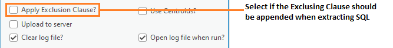

.. index::
	single: Running the tool

****************
Running the tool
****************

The operation of the Data Extractor tool is explained in this section. While the interface is similar between the ArcGIS Pro, ArcMap and MapInfo implementations of the tool, there are some differences. This user guide is specific to the ArcGIS Pro version of the tool.

As discussed in the :doc:`Setting up the tool <../setup/setup>` section, the Data Extractor tool is operated from a GIS project file within which the data required to run the tool is already loaded in the active map window. Therefore, before running the tool, ensure the following conditions are met:

- A GIS project has been created which contains both the partner layer and the data layers (containing the sites and other layers that will be queried) in a map window.
- The tool XML configuration file 'DataExtractor.xml' has been set up and is named correctly.
- One or more user XML profiles have been set up and are in the same folder as the tool XML file.
- The partner layer in the active map has the columns defined in the XML profiles.
- The Data Extractor tool has been installed and set up.

.. seealso::
	Please refer to the :doc:`Setting up the tool <../setup/setup>` section for further information about any of these requirements.

.. raw:: latex

   \newpage

.. index::
	single: Opening the form
	single: Running the tool; Opening the tool

Opening the tool
================

To open the Data Extractor tool in ArcGIS Pro, open the **Tools** menu bar and click on the **Data Extractor tool** button (:numref:`figLaunch`).

.. _figLaunch:

	Launching the Data Extractor tool in ArcGIS Pro

.. note::
	Once the tool has been opened the window pane will remain open unless it is manually closed. As with other dockable windows in ArcGIS Pro, the window can docked anywhere in the ArcGIS Pro application and can be pinned or hidden when not in use.

.. raw:: latex

   \newpage

.. index::
	single: Set-up
	single: Running the tool; Initial set-up

Initial set-up
==============

In order to function, the tool needs to know the location of the XML configuration files. The first time
the tool is run, or whenever the configuration file is moved, the user must specify the folder containing
the XML files.

Click on the 'Open folder' button (:numref:`figOpenXMLFolderButton`).

.. _figOpenXMLFolderButton:

.. figure:: figures/OpenXMLFolderButton.png
	:align: center

	Click on the Open Folder button

Then navigate to the folder containing the XML files and click OK. If the tool XML file is present and its
structure is correct, the list of user profiles will appear in the drop-down list (:numref:`figSelectConfigFolder`).

.. _figSelectConfigFolder:

.. figure:: figures/SelectConfigFolder.png
	:align: center

	Locating the configuration file folder

.. note::
	The location of the configuration folder will be stored for future use.

.. raw:: latex

   \newpage

.. index::
	single: Loading a profile
	single: Running the tool; Loading a profile

Loading a profile
=================

If more than one user XML profile is found, and the tool configuration file is configured to allow the user
to choose the XML profile, then the **Profile** tab will appear to allow the user to choose an XML profile (:numref:`figSelectXMLProfile`).

.. _figSelectXMLProfile:

	Example list of XML profiles to select

Select a profile and click 'Load' to start the tool using that profile. If there are any structural issues
with the selected XML profile, the tool will display a message with the error it has encountered, and not
load any further (:numref:`figLaunchWarning`).

.. _figLaunchWarning:

	Example warning message displayed for any XML structural issues

Provided that the selected XML profile is otherwise correct, the **Extract** tab will display 
(:numref:`figDisplayForm`).

.. _figDisplayform:

	The form displaying all of the available extract lists and options

.. note::
	If there is only one user XML profile, or if the tool configuration file is configured to **not** allow
	the user to choose the XML profile, then the default XML profile will lead automatically (if found).

.. raw:: latex

   \newpage

If any of the map layers specified in the XML profile are not present in the active map window then a warning message may appear (:numref:`figMissingLayersWarning`).

.. _figMissingLayersWarning:

	Example warning message that one of the layers is missing

A warning message will also appear on the form (:numref:`figMissingLayersWarning2`).

.. _figMissingLayersWarning2:

	Example warning message that one of the layers is missing

.. note::
	Layers missing from the active map will not appear in the 'Map Layers' list and hence will not be available for selection.

.. raw:: latex

   \newpage

.. index::
	single: Using the form
	single: Using the form; Specifying the extract

Specifying the extract
======================

The form can be used to process as many partners and tables as required during a single execution.

Select the partners you wish to run the extract for in the 'Active Partners' list (:numref:`figSelectPartners`).

.. _figSelectPartners:

	Select the partners to run the extract for

	.. tip::
		The attributes of a partner can be displayed by 'double-clicking' the partner name in the list of partners in the tool interface.

Select the SQL tables you wish to include in the extract in the 'SQL Layers' list (:numref:`figSelectSQLLayers`).

.. _figSelectSQLLayers:

	Select the SQL layers to include in the extract

	.. tip::
		The attributes of a SQL layer can be displayed by 'double-clicking' the layer name in the list of SQL layers in the tool interface.

.. raw:: latex

   \newpage

Select the Map tables you wish to include in the extract in the 'Map Layers' list (:numref:`figSelectMapLayers`).

.. _figSelectMapLayers:

	Select the Map layers to include in the extract

	.. tip::
		The attributes of a Map layer can be displayed by 'double-clicking' the layer name in the list of Map layers in the tool interface.

.. tip::
	Use the :kbd:`Ctrl` key to select multiple rows in the lists, :kbd:`Shift` key to select a range of rows or :kbd:`Ctrl A` to select all of the rows. Selected rows will appear highlighted, rows that will not be included remain unselected.

Next, select what type of SQL table extract you would like to carry out (:numref:`figSelectionTypeOptions`).

.. _figSelectionTypeOptions:

	Select the required selection type option

There are three options:

- **Spatial Only** ... SQL layer records are selected purely on whether they spatially intersect the partner boundary.
- **Survey Tags Only** ... SQL layers records are selected purely on the survey tags included in the TagsColumn.
- **Spatial and Survey Tags** ... Both a spatial intersection and any records with the relevant survey tags are included in the extract.

.. raw:: latex

   \newpage

Next, decide whether the exclusion clause defined in the XML profile, a user-defined SQL criteria for excluding any unwanted records, should be appended to any SQL criteria already defined against each SQL layer (:numref:`figExclusionClauseOption`). This can be useful, for example, to exclude non-commercially licensed records from some partners whilst allowing them to be included for others.

.. _figExclusionClauseOption:

	Select the required exclusion clause option

	.. note::
		The exclusion clause **only** relates to extracts from SQL tables and **not** to extracts from Map layers.

Then, decide whether the spatial intersect for SQL layer records should be based on the centroid for any polygon records, or if the polygon boundary should be used by default (:numref:`figUseCentroidsOption`).

.. _figUseCentroidsOption:

	Select the required use centroids option

Next, decide whether the partner layer should be uploaded to the SQL Server prior to processing the extract (:numref:`figUploadToServerOption`). This will ensure that the copy of the layer on the server is up-to-date.

.. _figUploadToServerOption:

	Select the required upload to server option

Finally, select whether the log file should be overwritten, and whether the log file should be opened upon completion (:numref:`figLogFileOptions`). Now the form is set up to run the extract.

.. _figLogFileOptions:

	Select the log file options

.. raw:: latex

   \newpage

.. index::
	single: Using the form; Running the extract

Running the extract
===================

Once the extract requirements have been specified and the options selected, click **Run**.

While the process is running a progress bar will appear at the bottom of the form providing details of progress (:numref:`figProgressBar`).

.. _figProgressBar:

	The progress bar as the extract is running

.. caution::
	The tool can run for a considerable amount of time dependent on the number of partners and layers that have been being selected.

.. raw:: latex

   \newpage

When the extract has finished the log file will be opened (:numref:`figLogFile`), if required, so that you can check the process has completed correctly.

.. _figLogFile:

.. figure:: figures/LogFileExample.png
	:align: center

	The log file shown when the extract finishes

The log file results of the process is saved in the :ref:`LogFilePath <logFilePath>` folder as specified in the XML configuration document.

You can now repeat the extract process for different partners and/or files as required.

.. raw:: latex

   \newpage

.. index::
	single: Extract results

Extract results
===============

All results are written to the :ref:`DefaultPath <defaultpath>` folder as specified in the XML configuration document. As shown in :numref:`figResults` each partner has its own sub-folder where the extract files for that partner are stored in the formats specified in the partner GIS layer.

.. _figResults:

.. figure:: figures/OutputFolderAnnotated.png
	:align: center

	Outputs are organised in partner-specific folders

.. note::
	The different output and export types can also be saved into separate sub-folders for each partner based on the settings of the XML configuration document. For more information see the :ref:`ArcGISFolder <ArcGISFolder>`, :ref:`CSVFolder <CSVFolder>` and :ref:`TXTFolder <TXTFolder>` general attributes.
