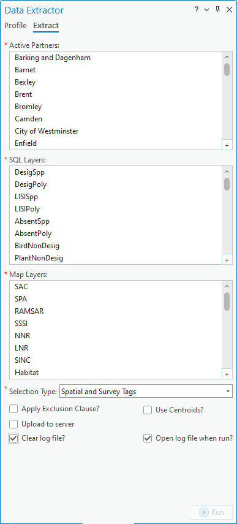

************
Introduction
************

.. index::
	single: Background

Background
==========

Carrying out data extracts (i.e. extracting records for partners/stakeholders for species, habitats, local wildlife sites, etc.) is a routine task for many Local Environmental Record Centres (LERCs). The process is a repetitive one, with the same kind of extract being carried out for what can be a considerable number of partners. Often, the only difference between partners is the geographical area they focus on, while the data they require can be represented by a few standard tables. Therefore this is a process that is ideally suited to being automated.

To facilitate performing data extracts a new interface was developed - the **Data Extractor** tool. The tool was originally developed for use with MapInfo for Greenspace Information for Greater London CIC (GiGL) but is now available for use with MapInfo, ArcMap Desktop and ArcGIS Pro (this version) and is used by a number of LERCs.

.. raw:: latex

   \newpage

.. index::
	single: Tool overview

Tool overview
=============

The Data Extractor tool is configurable in a flexible way according to the requirements of the LERC or individual user through an XML configuration file. It is integrated into the user interface of the GIS system and presented there as a button or menu item. The tool itself has a simple interface (:numref:`figUI`), requiring few user inputs and options. The output files can then be shared with the partner/stakeholder.

.. _figUI:

	The Data Extractor tool interface

Data layers for the tool can be contained in an SQL Server database or as GIS layers loaded in the GIS application. When performing an extract the tool uses a GIS layer, which is also uploaded to the associated SQL database, to define the boundary for each partner/stakeholder and extract the records which fall within this boundary. The attributes for each partner/stakeholder in this GIS layer define which of the available data layers will be extracted and in which format. Outputs are saved to a defined location, and a log file is kept that records the steps of each extract. The process is discussed in this document in more detail in the section on :doc:`running the tool <../execute/execute>`.

.. raw:: latex

   \newpage

Defining the way that extracts should be carried out, the output that they generate and the layers that can be included is done via a configuration file written in XML. Using this file the user can configure all the parts of the extraction, for example:

* The name of the GIS layer containing the partner boundaries, and its attribute columns.
* The location of the SQL Server SDE file (defining the connection details for the database).
* The location of the default output folder.
* For each data layer, a detailed definition of what attributes and records should be extracted.
* Details of any macro scripts to post-process the output files, if required.

Using this configuration file, each LERC can tailor the Data Extractor tool to its individual requirements. Examples of an XML profile are included in the :doc:`Appendix <../appendix/appendix>`, and the process of setting up this file is discussed in the section on :doc:`Setting up the tool <../setup/setup>`.

Additional to an XML profile the SQL server database must be set up with a number of auxiliary tables and stored procedures. Again, the process of configuring this is discussed in the section on :doc:`Setting up the tool <../setup/setup>`. 

.. index::
	single: Benefits

Benefits
========

There are a number of clear benefits to using the Data Extractor tool for carrying out routine data extracts for partners. 

1. The tool, by encapsulating and automating the process, saves considerable time over carrying out extracts manually.
#. Both the process and the outputs of the extraction are standardised, therefore minimising the risk of user error that is present in a manual extraction.
#. By specifying the outputs of the tool centrally through the configuration file, the output for each extraction is consistent with all other extracts, regardless of the individual carrying out the extraction. This leads to comparability of results and a predictable experience for the users of a data extraction service.
#. The extracts are repeatable and, through the inclusion of the log file, automatically documented.