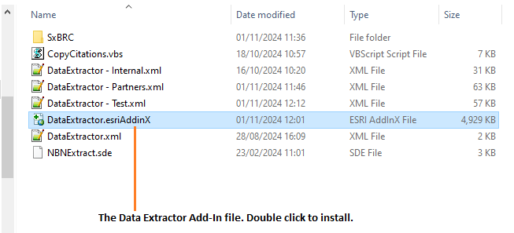
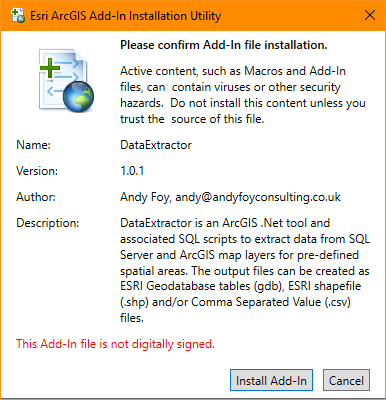
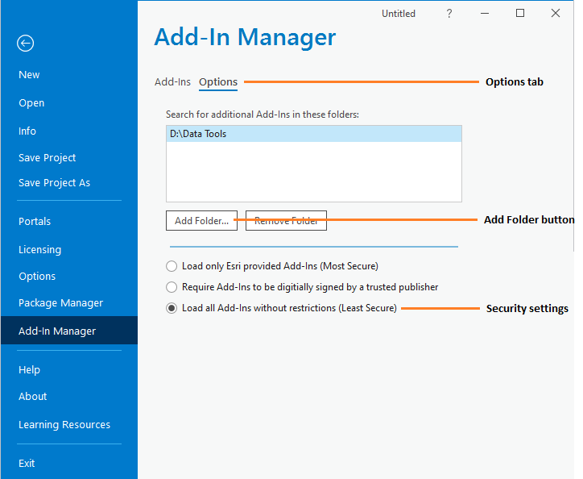
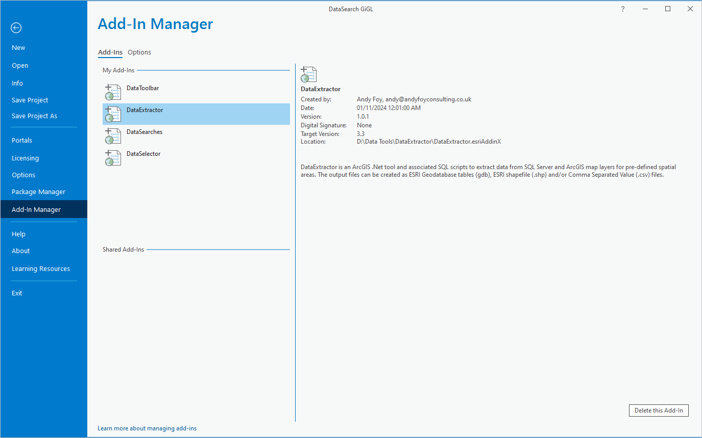

*******************
Setting up the tool
*******************

Before the Data Extractor tool will function, it needs to be installed and configured. It is essential that the configuration is carried out first. There are some differences between the setup for MapInfo and ArcGIS, which are made clear below.

.. index::
	single: Configuring the tool

Configuring the tool
====================

There are two configuration files used by the tool. They must be in the same folder.

Tool configuration file
-----------------------

This configuration file must be named 'DataExtractor.xml' and it must be present for the tool to load. It allows the user to control which configuration file to load, and contains just three settings:

ChooseXML
	Is the user allowed to choose their own configuration file? (Yes/No)

DefaultProfile
	What the default XML file called is called. If blank, the tool looks for DefaultProfile.xml.

HelpURL
	The URL of the online user guide (this guide).

.. caution::
	The name of this configuration file must be 'DataExtractor.xml'. The tool will not load if the file is not found.

User configuration profiles
---------------------------

These configuration files must be in the same folder as the tool configuration file. There can be as many profiles as you wish, each with different options and default settings. Each file contains all of the user options and default settings for the tool including, where files are kept, which SQL Server to connect to, which SQL Server tables to make available, and other general settings. Attributes and settings are presented as nodes (beginning with a start node, e.g. ``<example>``, and finishing with an end note, e.g. ``<\example>``), with the value for the setting held between the ``<value>`` and ``<\value>`` tag. 

.. note::
	The XML profiles can have any name prefix as long as they have a '.xml' file extension.

The XML file can be edited in a text editor such as Notepad. It is split into three sections:

_`General attributes`
	General and default attributes for the tool.

_`SQL Tables`
	Deals with how extracts from each SQL Server table should be handled.

_`Map Tables`
	Deals with how extracts from each GIS layer should be handled.

.. caution::
	It is important that the structure of the file is maintained as it is presented in the :doc:`Appendix <../appendix/appendix>`. Any changes to the structure may result in the Data Extractor tool not loading, or not working as expected.

Once editing has been completed and the edits have been saved, it is recommended that the configuration file is opened using an internet browser such as Edge which will help highlight any editing errors – only if the structure of the file is valid will the whole file be displayed in the Internet browser.

.. note::
	It is recommended that the configuration file is kept in a central (network) location, so that all users use the same configuration. Additionally, it is essential that the configuration file is kept in the same folder as the compiled version of the tool.

.. raw:: latex

   \newpage

.. index::
	single: General attributes

General attributes
******************

The first section of the configuration file deals with a series of general attributes for the Data Extractor tool. Each node specifies where files are kept, how output files should be named, where the log file will be saved as well as other overall settings. Details on these attributes (and their typical values where known) are outlined below. The list follows the order within which the attributes are found in the configuration file. This version of the configuration details is valid for the ArcPro version of the Data Extractor tool.

_`LogFilePath`
	The folder to be used for storing log files. This folder must already exist.

_`SDEFile`
	The location of the SDE file that specifies which SQL Server database to connect to.

_`SpatialStoredProcedure`
	The stored procedure to execute spatial selection in SQL Server.

_`SubsetStoredProcedure`
	The stored procedure to execute non-spatial subset selection in SQL Server.

_`ClearSpatialStoredProcedure`
	The stored procedure to clear the spatial selection in SQL Server.

_`ClearSubsetStoredProcedure`
	The stored procedure to clear the subset selection in SQL Server.

_`DefaultPath`
	The existing file location under which all partner sub-folders will be created.

_`PartnerFolder`
	The output sub-folder in which each partner's file will be created.

_`GDBName`
	The output filegeodatabase into which GDB files will be saved.

_`ArcGISFolder`
	The output sub-folder into which ArcGIS files will be saved. Leave blank to ignore.

_`CSVFolder`
	The output sub-folder into which CSV files will be saved. Leave blank to ignore.

_`TXTFolder`
	The output sub-folder into which TXT files will be saved. Leave blank to ignore.

_`DatabaseSchema`
	The schema used in the SQL database (typically ``dbo``).

_`IncludeWildcard`
	The Include wildcard for table names to list all the species tables in SQL Server that can be selected by the user to extract from.

_`ExcludeWildcard`
	The Exclude wildcard for table names that should NOT be used for species tables in SQL Server that can be selected by the user to extract from.

_`PauseMap`
	Whether the map processing should be paused during processing?

_`PartnerTable`
	The name of the partner GIS layer (and SQL Server table) used to select records. The tool expects this layer to be loaded in the active map.

	.. note::
		The partner GIS layer can be uploaded to SQL Server at the start of the extract process.
 
_`PartnerColumn`
	The column in the PartnerTable containing the partner name, which is passed to SQL Server by the tool to use the partner's boundary for selecting the records.

_`ShortColumn`
	The name of the column in the partner GIS layer containing the abbreviated name to use as the sub-folder name for the destination of extracted records. The sub-folder is created in the DefaultPath during extract if it does not already exist.

_`NotesColumn`
	The name of the column in the partner GIS layer containing any notes text relating to the partner.

_`ActiveColumn`
	The name of the column in the partner GIS layer containing the Y/N flag to indicate if the partner is currently active.  Only active partners will appear in the tool interface and be available for processing. The values in this column should be ``Y`` or ``N``.

_`FormatColumn`
	The name of the column in the partner GIS layer containing the GIS format required for the output records. The values in the column should be ``SHP`` or ``GDB``. If it is left blank no spatial outputs will be generated.

_`ExportColumn`
	The name of the column in the partner GIS layer indicating whether an export should also be created as a CSV file. The values in this column should be ``CSV`` or ``TXT``. If it is left blank no text exports will be generated.

_`SQLTableColumn`
	The name of the column in the partner GIS layer indicating which SQL table should be used for that partner.

_`SQLFilesColumn`
	The name of the column in the partner GIS layer indicating which SQL tables should be extracted for each partner. The entry in this column should be a comma-delimited list of the names of the layers (as defined in the XML file under :ref:`SQLTables <SQLTablesArc>`) that should be included for each partner.

_`MapFilesColumn`
	The name of the column in the partner GIS layer indicating which ArcGIS layers should be extracted for each partner. The entry in this column should be a comma-delimited list of the names of the layers (as defined in the XML file under :ref:`MapLayers <MapLayers>`) that should be included for each partner.

_`TagsColumn`
	The name of the column in the partner GIS layer indicating which survey tags, if any, should be included in the export. The survey tags should be a comma-delimited list.

_`SpatialColumn`
	The name of the column in the partner GIS layer containing the spatial geometry.

_`PartnerClause`
	The where clause to determine which partners to display.

_`SelectTypeOptions`
	The option list for the selection types to be included in the 'Selection Type' drop-down box on the tool interface. This attribute should not be changed. The options are ``Spatial Only`` (records are purely selected on whether they are inside or outside the partner boundary), ``Survey tags only`` (records are purely selected on the survey tags included in the TagsColumn), and ``Spatial and Survey Tags``, where both a spatial intersection and any records with the relevant survey tags are included in the extract.

	.. note::
		The 'Selection Type' option in the tool interface **only** relates to extracts from SQL tables and **not** to extracts from GIS layers (which are always spatial).

_`DefaultSelectType`
	The selection type that should be shown by default in the 'Selection Type' drop-down list. This attribute is the index number of the selection type options in the drop-down list, with 1 being the first option.

_`ExclusionClause`
	The SQL criteria for excluding any unwanted records. The clause is appended to any SQL criteria already defined against each SQL layer.

_`DefaultApplyExclusionClause`
	A Yes/No attribute that that defines whether the check box for 'Apply exclusion clause?' will be set to checked (``Yes``) or unchecked (``No``) when the form is opened. Leave blank to hide the option in tool interface (and default to ``No``).

	.. note::
		The 'ExclusionClause' and 'Apply Exclusion Clause?' option in the tool interface **only** relates to extracts from SQL tables and **not** to extracts from Map layers.

_`DefaultUseCentroids`
	A Yes/No attribute that that defines whether the check box for 'Use Centroids?' will be set to checked (``Yes``) or unchecked (``No``) when the form is opened. Leave blank to hide the option in tool interface (and default to ``No``).

_`DefaultUploadToServer`
	A Yes/No attribute that that defines whether the check box for 'Upload to server?' will be set to checked (``Yes``) or unchecked (``No``) when the form is opened. Leave blank to hide the option in tool interface (and default to ``No``).

_`DefaultClearLogFile`
	A Yes/No attribute that that defines whether the check box for 'Clear log file?' will be set to checked (``Yes``) or unchecked (``No``) when the form is opened.

_`DefaultOpenLogFile`
	A Yes/No attribute that that defines whether the check box for 'Open log file when run?' will be set to checked (``Yes``) or unchecked (``No``) when the form is opened.

.. raw:: latex

   \newpage

.. index::
	single: SQL layer attributes

SQL layer attributes
********************

While the spatial selection that the tool carries out is over the entirety of the SQL table selected associated with each partner, subsets of this data can be written out using the SQL table attributes. The details of these subsets are defined in the ``<SQLLayers>`` node.

For each subset that may be included in the extracts a new child node must be created. For example, the node name (e.g. ``<AllSpecies>``) is a user-defined name used to identify an individual subset - the same name should be used in the `SQLFiles`_ column in the partner layer to indicate that this subset should be extracted for a partner.

The attributes that are required for each SQL table are as follows:

_`OutputName`
	The name of the output GIS layer or text file that will be created for this subset.

_`Columns`
	A comma-separated list of columns that should be included in the data output and export for this subset. The column names (not case sensitive) should match the column names in the source table.

_`WhereClause`
	The SQL clause that should be used to select the data for this subset from the SQL table. This clause could, for example, ensure records are only included that have been entered after a certain date, are verified, are presence (not absence) records, or are a subset for particular taxon groups or protected species. Leave this entry blank to export the entire SQL table.

	.. note::
		Clauses specified here must adhere to SQL Server syntax as the clause will be run within SQL Server.

_`OrderColumns`
	A comma-separated list of columns that should be used to sort the output and export for this subset. Including ``DESC`` after any column names will cause the sorting to be descending (reversed) for that column.

_`MacroName`
	The file path and name of a visual basic macro script (.vbs file) to be triggered once a TXT or CSV export has been created for this subset.

_`MacroParm`
	Any parameters to be passed to the macro script. What parameters are required/expected will depend on the design of the macro.

.. raw:: latex

   \newpage

.. index::
	single: Map layer attributes

Map layer attributes
********************

.. _MapLayers:

All map layer attributes are found within the ``<MapLayers>`` node. For each data layer that can be included in the extracts a new child node must be created. For example, the node name (e.g. ``<SSSIs>``) is a user-defined name used to identify the layer - the same name should be used in the `MapFiles`_ column in the partner layer to indicate that this layer should be extracted for a partner. The attributes that are required for each map layer are as follows:

_`LayerName`
	The name of the source GIS layer as it is known in the ArcPro active map. This is also the name that will be used for the output shapefile or geodatabase feature class.

_`OutputName`
	The name that will be used for any TXT or CSV export files.

_`OutputType`
	Used to override the `FormatColumn`_ and `ExportColumn`_ values for each partner to force the output/export type to match the specified format. Valid values are ``SHP``, ``GDB``, ``TXT`` or ``CSV``. If it is left blank the output and export formats specified for the partner will be applied.

_`Columns`
	A comma-separated list of columns that should be included in the data outputs from this GIS layer during the extract. The column names (not case sensitive) should match the column names in the source GIS layer.

_`WhereClause`
	The SQL clause that should be used to select the data for this layer from the source GIS layer. Leave this entry blank to output the entire source GIS layer.

_`OrderColumns`
	A comma-separated list of columns that should be used to group and sort the output and export for this subset (e.g. ``Group By SiteRef, SiteName Order By SiteRef, SiteName``). Including ``DESC`` after any Order By column names will cause the sorting to be descending (reversed) for that column.

_`LoadWarning`
	A Yes/No attribute that defines whether a warning should be issued if this layer is not loaded in ArcPro.

_`MacroName`
	The file path and name of a visual basic macro script (.vbs file) to be triggered once a TXT or CSV export has been created for this subset.

_`MacroParm`
	Any parameters to be passed to the macro script. What parameters are required/expected will depend on the design of the macro.

	.. note::
		Any clause specified here must adhere to ArcGIS Pro SQL syntax as the clause will be run within ArcGIS.

.. raw:: latex

   \newpage

.. index::
	single: Special characters in XML

Special characters in XML
-------------------------

The characters ``&``, ``<`` and ``>`` are not valid within values and, so in order to be used, must be **escaped** with XML entities as follows:

<
	This must be escaped with ``&lt;`` entity, since it is assumed to be the beginning of a tag. For example, ``RecYear &lt; 2010``

>
	This should be escaped with ``&gt;`` entity. It is not mandatory -- it depends on the context -- but it is strongly advised to escape it. For example, ``RecYear &gt; 1980``

&
	This must be escaped with ``&amp;`` entity, since it is assumed to be the beginning of a entity reference. For example, ``TaxonGroup = 'Invertebrates - Dragonflies &amp; Damselflies'``

.. raw:: latex

   \newpage

.. index::
	single: Setting up the SQL database

Setting up the SQL Server database
==================================

In addition to any SQL tables containing records to be extracted using the Data Extractor tool, two auxiliary tables and one view must also be present in the SQL Server database in order for the tool to be able to extract data from tables held in SQL Server. These are as follows:

_`Survey` table
	The Survey table is a standard table in the Recorder6 database. It is used to identify any records tagged with any survey tags listed in the `TagsColumn`_ column in the partner GIS layer.

_`Spatial_Tables` table
	This table contains information about any SQL data tables that may be used by the tool. The table has the following columns:

	.. tabularcolumns:: |L|L|

	.. table:: Format of the Spatial_Tables table

		+-----------------+-----------------------------------------------------------------------------------------------+
		|      Column     |                                          Description                                          |
		+=================+===============================================================================================+
		| TableName       | The name of the data table                                                                    |
		+-----------------+-----------------------------------------------------------------------------------------------+
		| OwnerName       | The database owner, usually ``dbo``                                                           |
		+-----------------+-----------------------------------------------------------------------------------------------+
		| XColumn         | The name of the column holding the X coordinates of the record                                |
		+-----------------+-----------------------------------------------------------------------------------------------+
		| YColumn         | The name of the column holding the Y coordinates of the record                                |
		+-----------------+-----------------------------------------------------------------------------------------------+
		| SizeColumn      | The name of the column holding the grid size of the record (in metres)                        |
		+-----------------+-----------------------------------------------------------------------------------------------+
		| IsSpatial       | Bitwise column (1 = Yes, 0 = No) defining whether the table is spatially enabled              |
		+-----------------+-----------------------------------------------------------------------------------------------+
		| SpatialColumn   | If the table is spatially enabled, the name of the geometry column (e.g. ``SP_GEOMETRY``)     |
		+-----------------+-----------------------------------------------------------------------------------------------+
		| SRID            | The name of the spatial reference system used to plot the records                             |
		+-----------------+-----------------------------------------------------------------------------------------------+
		| CoordSystem     | The coordinate system of the spatial data in the table                                        |
		+-----------------+-----------------------------------------------------------------------------------------------+
		| SurveyKeyColumn | The column containing the survey key for each record                                          |
		+-----------------+-----------------------------------------------------------------------------------------------+

	.. note::
		The British National Grid `SRID` value is
		``Earth Projection 8, 79, "m", -2, 49, 0.9996012717, 400000, -100000 Bounds
		(-7845061.1011, -15524202.1641) (8645061.1011, 4470074.53373)``

	.. caution::
		This table must be filled out correctly for each SQL table or view that is available to the Data Extractor tool.

_`Spatial_Objects` view
	This view provides a list of all tables and views in the SQL database that contain spatial 'geometry' and hence are available to the Data Extractor tool.

	.. note::
		A number of stored procedures that are used by the tool for selecting the required records must also be present in the SQL Server database. To obtain copies of the above table and view, and these stored procedure,s please contact `Andy Foy <mailto:andy@andyfoyconsulting.co.uk>`_.

.. raw:: latex

   \newpage

.. index::
	single: Installing the tool

Installing the tool
===================

Installing the tool in ArcGIS Pro is straightforward. There are two ways it can be installed:

.. note::
	Before installing the tool you will need to install another ArcGIS Pro add-in 'DataToolbar'. This add-in with simply create a new 'Tools' toolbar onto which the Data Extractor tool and other Data tools will be added once installed. To install the toolbar follow the instructions below using  the DataToolbar add-in.

Installation through Windows Explorer
-------------------------------------

Open Windows Explorer and double-click on the ESRI Add-in file for the Data Extractor tool (:numref:`figInstallTool`).

.. _figInstallTool:

	Installing the Data Extractor tool from Windows Explorer

.. raw:: latex

   \newpage

Installation will begin after confirming you wish to install the tool on the dialog that appears (:numref:`figConfirmInstall`).

.. _figConfirmInstall:

	Installation begins after clicking 'Install Add-in'

Once it is installed, it will appear in the Add-In Manager and on the 'Tools' menu bar.

.. note::
	The 'Tools' menu bar will only appear once the DataToolbar add-in has also been installed.

.. caution::
	In order for this process to work all running ArcGIS Pro sessions must be closed. The tool will not install or install incorrectly if there are copies of ArcGIS Pro running.

.. raw:: latex

   \newpage

Installation from within ArcGIS Pro
-----------------------------------

Firstly, open ArcGIS Pro and go to the Add-In Manager through the Project menu (:numref:`figOpenAddInManager`).

.. _figOpenAddInManager:

.. figure:: figures/StartAddInManager.png
	:align: center

	Starting the ArcGIS Add-In Manager

.. raw:: latex

   \newpage

If the Data Extractor tool is not shown, use the **Options** tab to add the folder where the tool is kept (:numref:`figAddInOptions`). The security options should be set to the lowest setting as the tool is not digitally signed.

.. _figAddInOptions:

	The 'Options' tab in the ArcGIS Pro Add-In Manager

.. note::
	Adding a network folder in the options tab will mean that all ArcGIS Pro add-ins in that folder, and all sub-folders, will be loaded when ArcGIS Pro starts.

After restarting ArcGIS Pro the tool will show in the Add-In Manager (:numref:`figAddInManager`) and on the 'Tools' menu bar.

.. _figAddInManager:

	The ArcGIS Pro Add-In Manager showing the Data Extractor tool

.. note::
	The 'Tools' menu bar will only appear once the DataToolbar add-in has also been installed.
